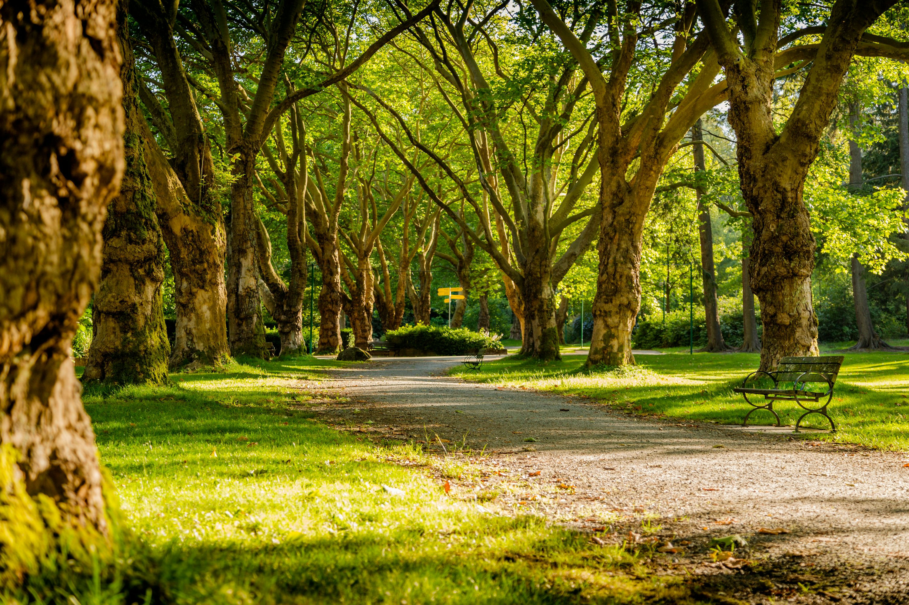

# Background changer using Detctron2

## oringinal image:

## background to change to:

## Result:

## How does it work

This project allows you to segment objects from an image using Detectron2, interactively select objects, and stitch those objects onto a background image in their original pixel positions. The user can select which segmented objects to stitch, and the final image is saved as output. It might not be as accurate as doing it yourself in photoshop but it works well enough.

## TO DO

To keep a track of project i am gonna keep a track here and feel free to put in pull request

* [x] make a proper README
* [x] add image segmenation
* [ ] add command to change LINEAR to BILINEAR(/venv/lib/python3.9/site-packages/detectron2/data/transforms/transform.py) under Locate the ExtentTransform class: In the transform.py file, search for the following line inside the ExtentTransform
* [x] add a way to find the pixels in the segmentation
* [x] change the way of calling the detction class from venv and add a command for it
* [ ] make sure to use python3.9 for creating the venv
* [ ] make sure to also add pytorch script in the readme (pip install torch==1.9.1 torchvision==0.10.1 torchaudio==0.9.1)
* [ ] make a GUI for it
